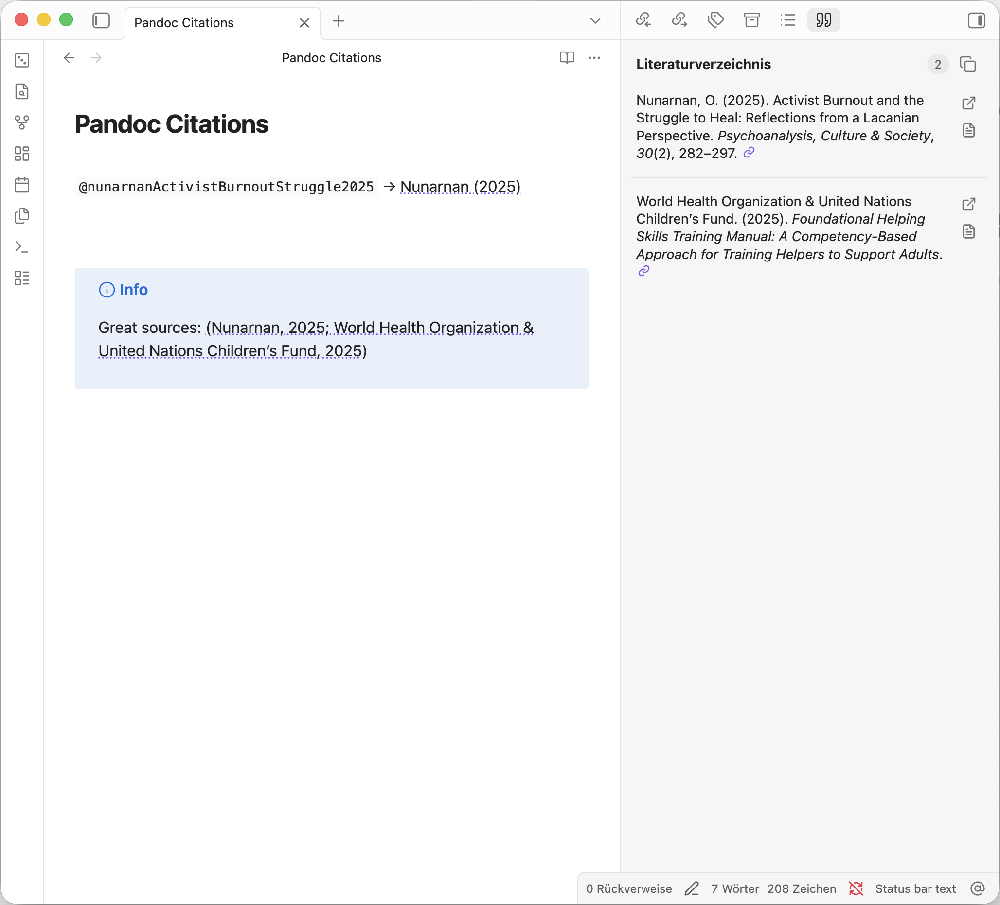

## Obsidian Pandoc Reference List

Displays a formatted reference in the sidebar for each pandoc citekey present in the current document.

Setup:
- Ensure [Pandoc](https://pandoc.org/) is installed. **This plugin requires at least version 2.11**.
- Supply a path to a compatible bibliography file or enable Zotero integration. Zotero must be running locally; bibliography
  entries are read through Zotero's local API (which you need to enable in the Zotero settings!) and use its native citation keys.
- Choose a citation style
- Run "Pandoc Reference List: Show reference list" from Obsidian command palette to display References tab in the sidebar, or enable it in the settings




Originally developed by [Matthew Meyers (mgmeyers)](https://github.com/mgmeyers) - thank you so much!

## Development

This fork targets Obsidian 1.13.0 and newer. Install dependencies and run the
usual checks with Node.js 24.21.0 or newer:

```sh
npm ci
npm run check-types
npm run lint
npm test
npm run build
```
